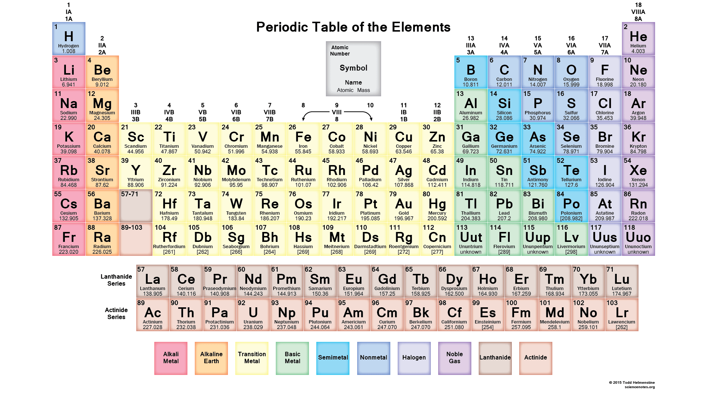

# 1. Introduction

## Stars in the cosmological context

**MW center**

**Other galaxies**

 

## Stars and how the elements form

### Mass fractions of light isotopes

| Isotope | Big Bang  | Solar |
|-------------- | ------------- | ------------- |
| $^1$H | 0.753              | 0.715          |
| $^2$H | 1.94e-5  | 1.43e-5 |
| $^3$He | 7.53e-6  | 4.49e-5 |
| $^4$He | 0.247  | 0.270 |
| $^6$Li | 9.70e-15  | 6.44e-10 |
| $^7$Li | 3.50e-10  | 9.15e-9 |

 

### Nucleosynthesis

* The elements are made in stars and stellar explosions (except H, He, Li in BBN)
* Stellar abundances are the result of the details of the thermodynamic and mixing evolution of the progenitor evolution

**Chart of nuclei**

**Binding energy per nucleon**

## Stars in the astronomical context

### Galactic archeology and near-field cosmology

- use predictive yields as tool for a wide range of astronomy applications:

  - constrain the environment in which the solar system formed

  - investigate the formation and evolution of structure in the Universe

  - determine chemical evolution of galaxies

  - characterize stellar populations

## Stars and pre-solar grains

 

## Stars and their sometimes peculiar chemical composition

## Stars as a multi-physics, multi-scale proble

### Definition of a star

A star is a gravitationally bound spatially isolated mass of baryonic matter
that is opaque for radiation, in which thermonuclear reactions transforming hydrogen into helium
had either occurred in the past, occurring at present, or will occur in the future on a relatively large scale.

### Physics processes involved

 

### From observations to stellar structure and populations 

 

### Overview of topics in stellar astrophysics

 

