# 2. Conservation Laws and Stellar Structure

## Examples of astrophysical fluids

1. Stars, with big dynamic contrast, what is moving? convection, waves, at the surface very low densities and fluid treatment may not be justified
2. ISM, IGM, on average 1 particle per $cm^3$ but huge variation, multi-phase medium: hot, warm, cold components
3. Stellar winds, jets, accretion disks, interiors of giants

## The fluid element

What requirements have to be met so that a fluid can be treated by the _fluid equations_?

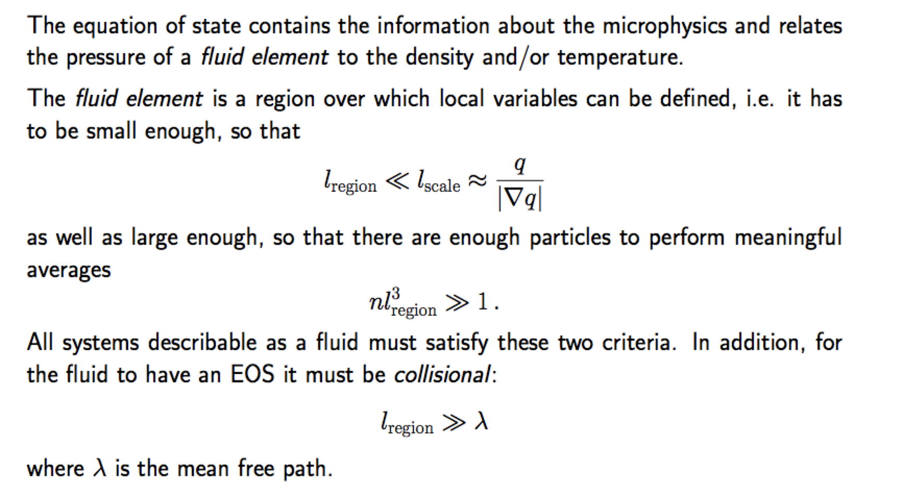

## Eulerian vs Lagrangian formulation

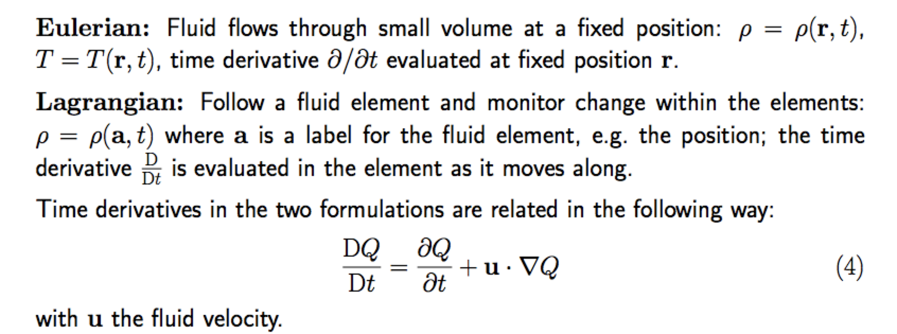

## Mass Conservation 

The equation for mass conservation in the context of stellar physics is given by the continuity equation:

$$
\frac{\partial \rho}{\partial t} + \nabla \cdot (\rho \mathbf{v}) = 0
$$

Where:

- $\rho$ is the mass density of the stellar material.
- $t$ is time.
- $\mathbf{v}$ is the velocity vector field of the stellar material.
- $\nabla \cdot$ denotes the divergence operator.

This equation ensures that the rate of change of mass density in a given volume, plus the net flow of mass out of that volume, is zero, thereby conserving mass within the volume.

* [ ] Show that incompressible fluids are divergence-free.

### Dimensional Analysis of the Continuity Equation

Given the continuity equation:
$$
\frac{\partial \rho}{\partial t} + \nabla \cdot (\rho \mathbf{v}) = 0
$$

1. **Term $\frac{\partial \rho}{\partial t}$**:
   - $\rho$: $[M][L^{-3}]$
   - $t$: $[T]$
     Dimensions: $[M][L^{-3}][T^{-1}]$

2. **Term $\nabla \cdot (\rho \mathbf{v})$**:
   - $\rho$: $[M][L^{-3}]$
   - $\mathbf{v}$: $[L][T^{-1}]$
     Dimensions: $[M][L^{-3}][T^{-1}]$

Both terms have dimensions $[M][L^{-3}][T^{-1}]$, confirming the equation is dimensionally homogeneous.

* [ ]  there is an error in the section above, what is the error?

## Pressure, momentum flux and momentum conservation

Momentum: $$\vec{p} = m \vec{v}$$

Flux: 
$$
 \frac{\mathrm{something}}{\mathrm{time}\times \mathrm{unit\ area}}
$$

Force: $$\vec{F} = m \vec{a} = \frac{d\vec{p}}{dt}$$

Pressure: $$P = \frac{d\vec{F}}{\hat{s}}=\frac{d\vec{p}}{dt \hat{s}}$$
where $\hat{s}$ is the unit area.

Therefore: **pressure $\equiv$ momentum flux**

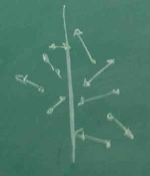

## Momentum equation

Clarke & Carswell section 2.3

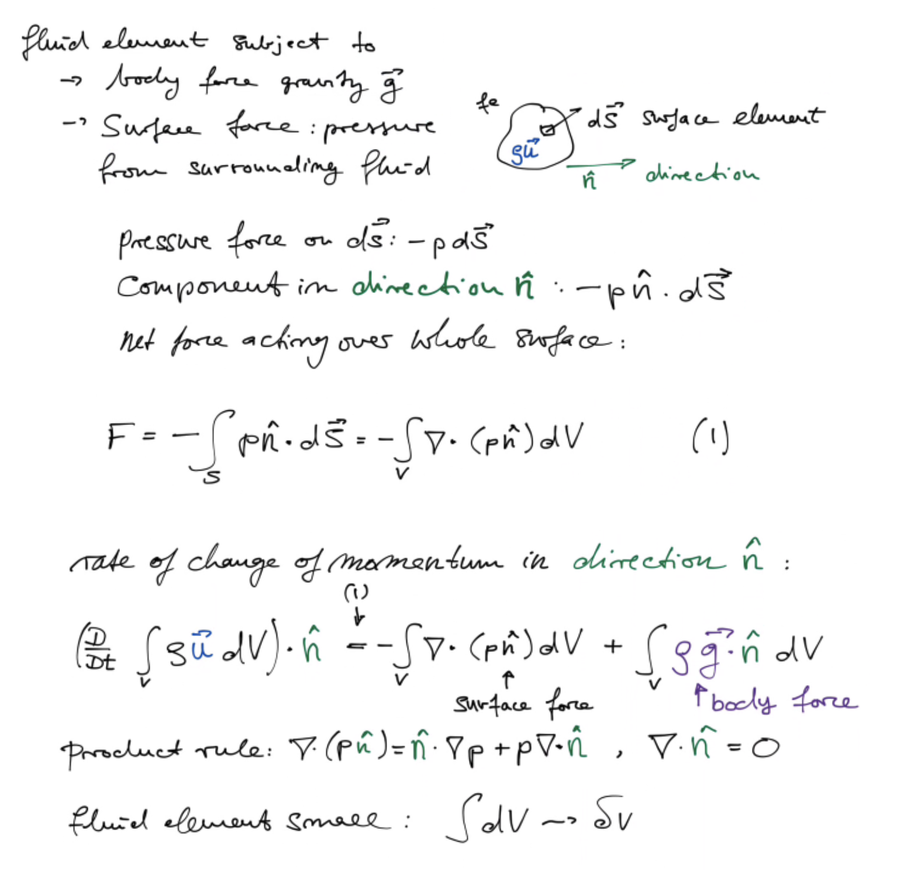

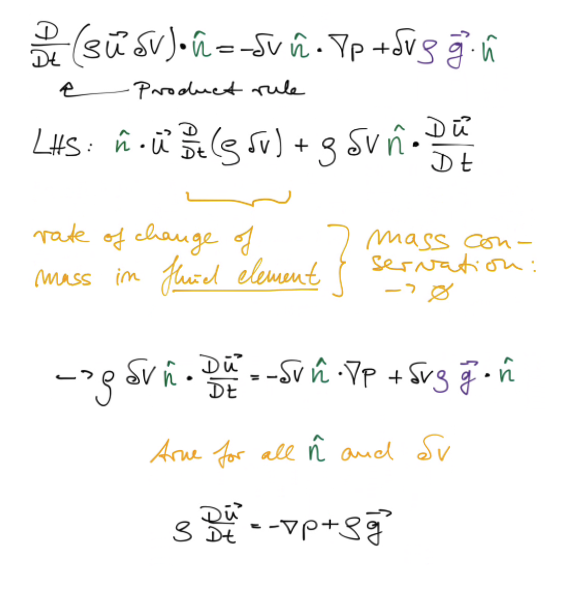

### Gravity

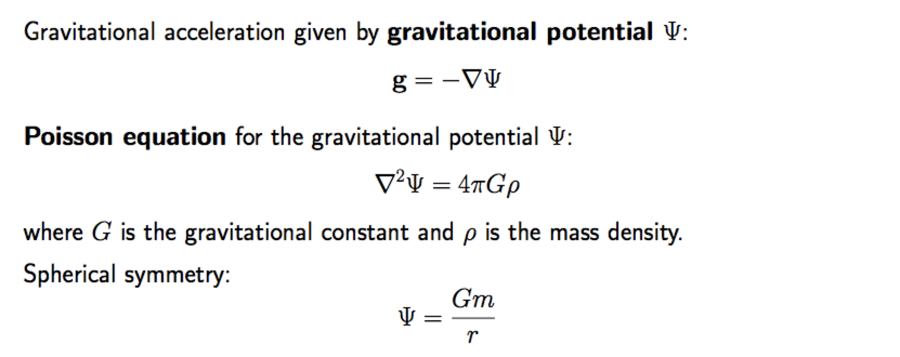

For suitable symmetry the Poisson equation allows to calculate the gravitational field vector $\vec{g}$ directly through identifying _Gaussian surfaces_. As in electrostatics, use integral form which is obtained Via Gauss' theorem.

### Viral theorem

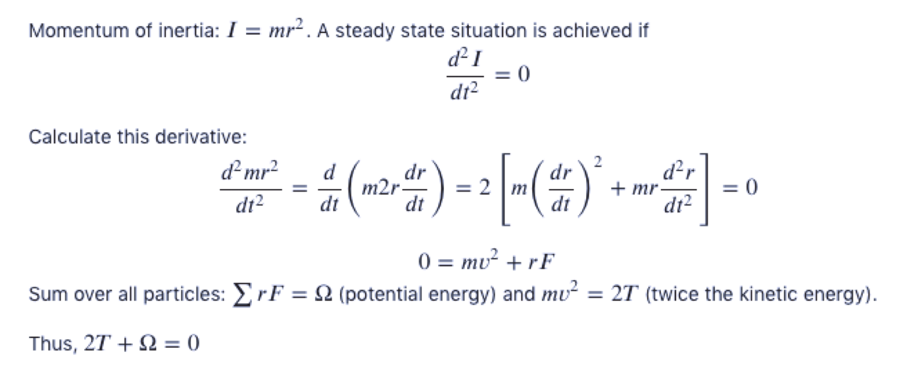

### Mass and momentum equations

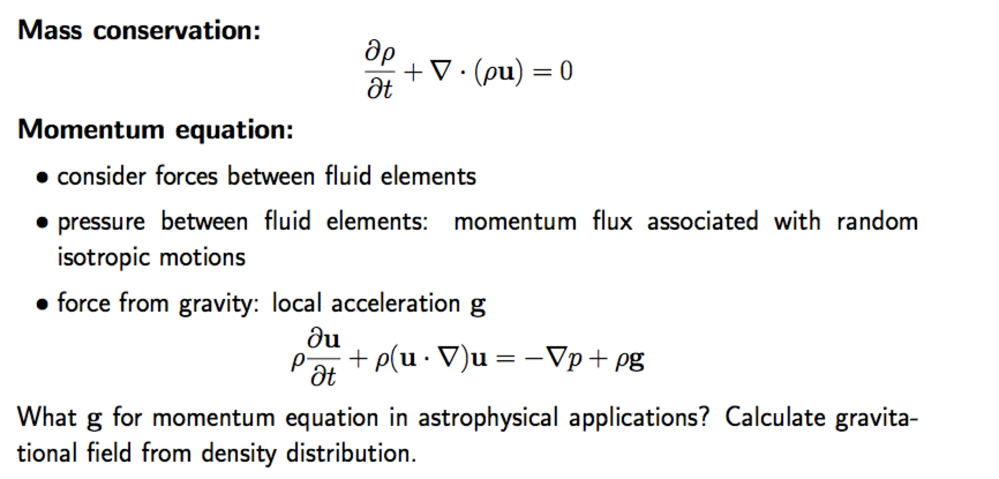

### Navier-Stokes equation

The momentum equation we have derived above is the Euler equation which ignores the effect of viscosity. It applies when viscosity is not important. The momentum equation with viscosity is the Navier-Stokes equation.

(Kundu, Cohen, Dowling: Fluid Mechanics)

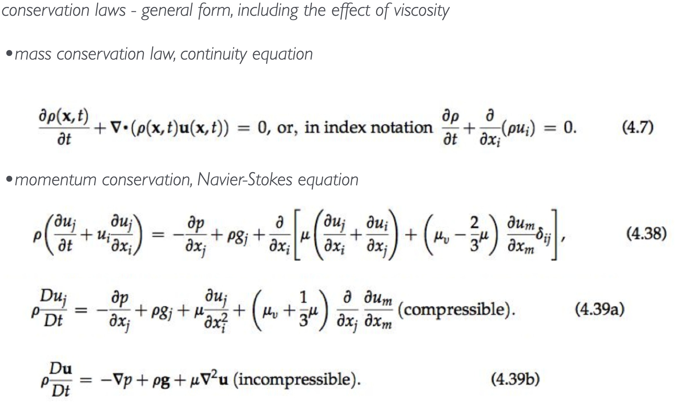

## Energy conservation

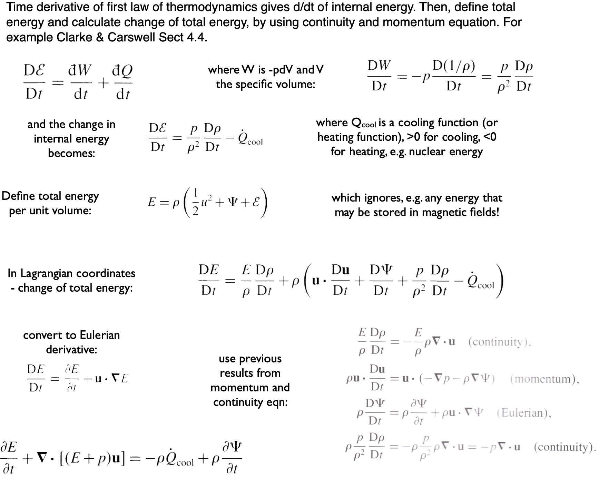

## Simulation codes

#### N-body Simulation Code

Gravitational interactions between a large number of particles, cosmological dark-matter simulations.

- Discrete particles representing stellar or galactic components.
- Algorithms for calculating gravitational forces (e.g., direct summation, tree codes, or particle mesh methods).
- Ignores gas dynamics or electromagnetic forces.
- Assumes point masses with gravitational interactions.
- **Type**: Lagrangian approach (tracks individual particles).

#### Smoothed-Particle Hydrodynamics (SPH) Code

Method for simulating fluid flows without obvious symmetry, SN explosions, stellar mergers.

- Particles representing fluid elements.
- Kernel smoothing for interpolating physical quantities.
- Fluid is compressible and can be discretized into particles.
- Interactions include hydrodynamics and possibly self-gravity.
- **Type**: Lagrangian approach (fluid motion tracked via particles).

#### Cartesian Grid Code

Simulation of fluids or fields on a fixed grid in Cartesian coordinates, dynamic processes in hydrostatic stars; star formation if adaptive-mesh refinement AMR is included.

- Uniform or adaptive grid.
- Finite difference or finite volume methods for solving partial differential equations.
- Fluid or field properties are defined at grid points.
- Boundary conditions and external forces can be specified.
- **Type**: Eulerian approach (observes fluid or field properties at fixed spatial points).

#### Arbitrary Lagrangian-Eulerian (ALE) Approach

Combines aspects of both Lagrangian and Eulerian methods.

- Grid can move and deform with the fluid (Lagrangian) or remain fixed (Eulerian).
- Useful in situations with large deformations or flow instabilities.
- **Type**: Hybrid approach, transitioning between Lagrangian and Eulerian as needed.

## Classification of fluid dynamics regimes through dimensionless numbers

### Momentum equation in dimensionless form

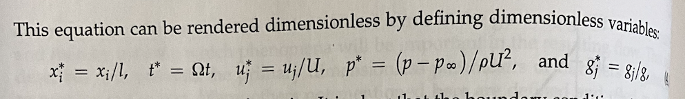

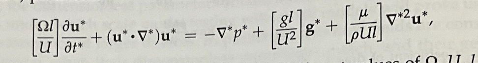

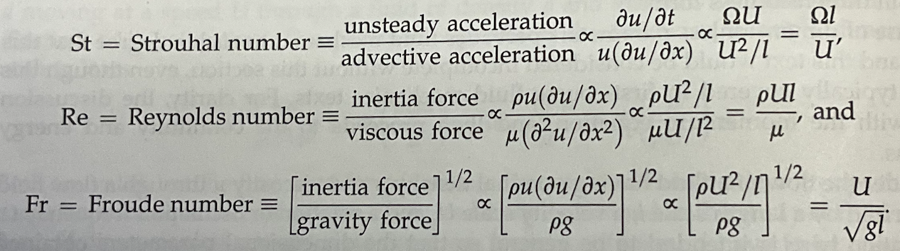

### Key numbers

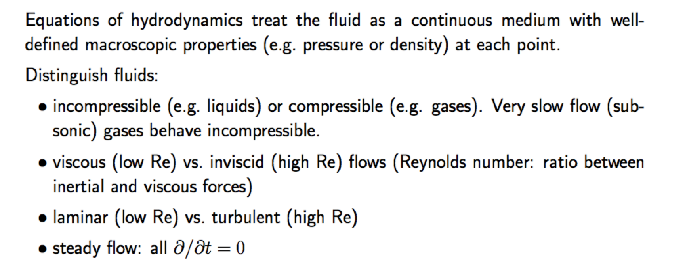

## Hydrodynamic instabilities

### Rayleigh-Taylor instability

Unstable stratification of fluid layers overturns und the influence of gravity. This instability can be observed in two important cases:

* Convective instability: the motion of a fluid element that has some heat excess and rises adiabatically
* Stratified fluids, such as a heavier fluid on top of a lighter fluid

### Kelvin-Helmholtz instability

Instability induced by a gradient in horizontal velocity, or shear flow. See *McNally, Lyra, Passy, 2012, 2012ApJS..201...18M* for numerical work on this co-authored by our former graduate student Jean-Claude Passy.

Credit: Mallory Loria (UVic graduate student)

## One-dimensional stellar struture and evolution

### The stellar evolution problem on one page
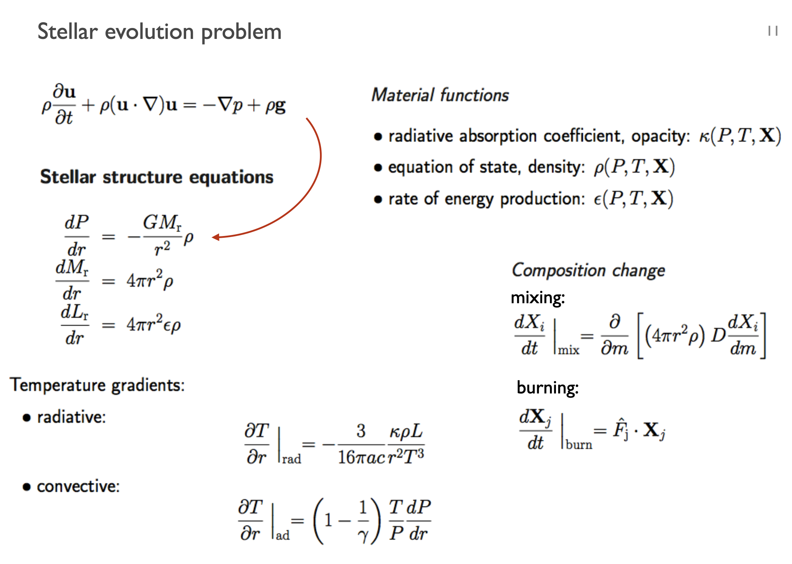

## Opacities

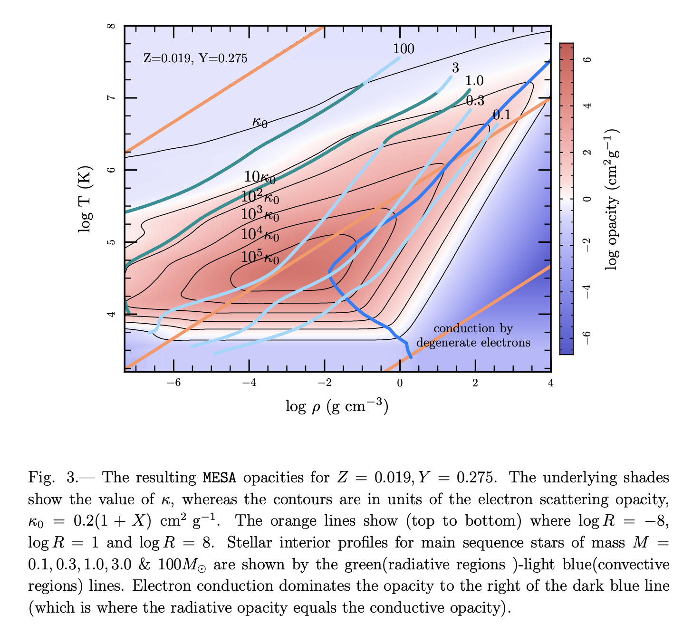

## Equation of State

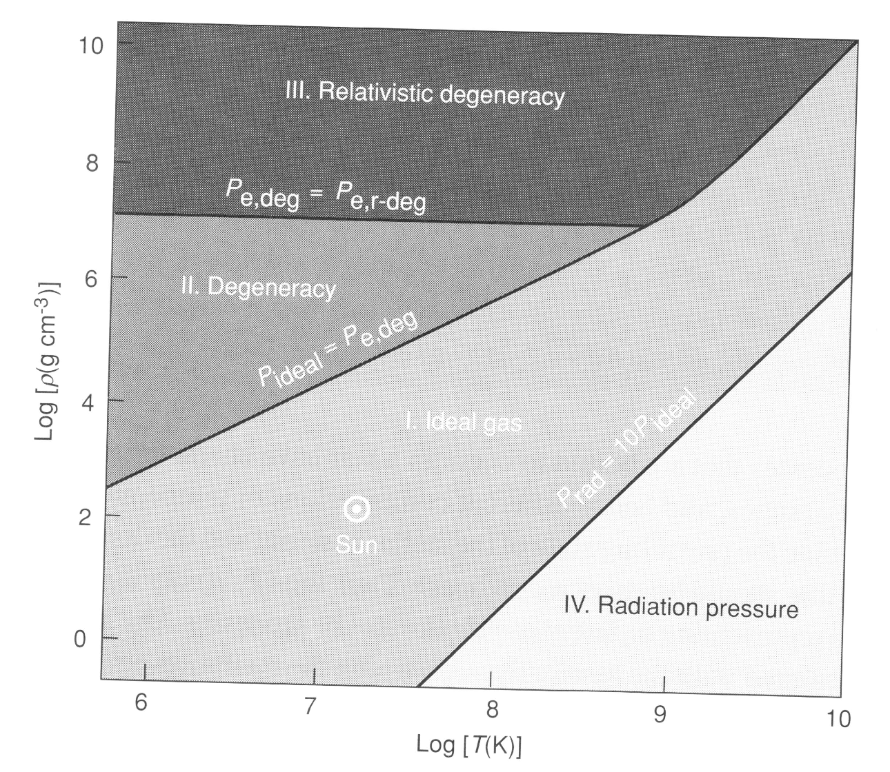

