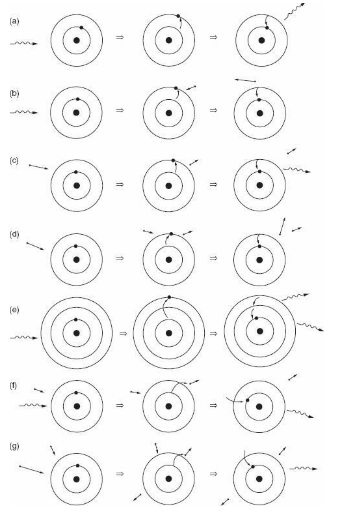

# Radiative energy transport

In this section we are only dealing with the optically thick case in which the mean-free path of photons is short (compared to the size of a _fluid element_). 

## Opacities

### Matter - radiation interactions

* Radiative opacity is a physical quantity that is a function of frequency and it measures the capability of matter to absorb or scatter photons. 
* The scattering of photons is defined as a deviation of these particles from their trajectory following an interaction with matter.

LeBlanc, Francis. An Introduction to Stellar Astrophysics . Wiley. Fig. 3.1

* (a) bound-bound excitation and de-excitation to same level (scattering)
* (b) excitation with de-excitation due to electron passing by (bound-bound transition)
* (c) excitation from electron collision and radiative de-excitation
* (d) excitation from electron collision with de-excitation due to electron passing by
* (e) radiative excitation and two radiative de-excitations emitting two photons
* (f) radiative ionization and recombination with emission of photon carrying excess energy (bound-free transition)
* (g) excitation from electron collision and recombination with emission of photon carrying excess energy

Radiative opacities can be divided into four types:

1. bound–bound transitions
2. bound–free transitions
3. free–free transitions (opposite of Bremsstrahlung)
4. scattering of photons.

#### Definitions

* opacity  $\kappa_\nu$ with unit $\mathrm{cm^2/g}$ (cross section per unit mass)
* mean free path of photon $l_\mathrm{ph} = (\rho \kappa_\nu)^{-1}$

The **Planck function** or **Planck blackbody radiation function** describes the spectral radiance of a black body at a certain temperature. It is given by the formula:

$$
B_\nu(T) = \frac{2h\nu^3}{c^2} \frac{1}{e^{\frac{h\nu}{k_BT}} - 1}
$$

where:
- $ B_\nu(T) $ is the spectral radiance, the amount of energy emitted per unit surface area per unit time per unit solid angle per unit frequency, by a black body at temperature $ T $,
- $ h $ is the Planck constant ($6.626 \times 10^{-34} \, \text{m}^2 \text{kg} / \text{s}$),
- $ \nu $ is the frequency of the electromagnetic radiation,
- $ c $ is the speed of light in a vacuum ($2.998 \times 10^8 \, \text{m/s}$),
- $ k_B $ is the Boltzmann constant ($1.381 \times 10^{-23} \, \text{J/K}$),
- $ T $ is the absolute temperature of the black body in Kelvin.

The Planck function is fundamental in the field of astrophysics and quantum mechanics, describing the spectral distribution of radiation from a black body, which is an idealized physical body that absorbs all incident electromagnetic radiation and re-emits it in a characteristic spectrum.

[Kippenhahn & Weigert Section 5.1]

The **Rosseland mean opacity**, denoted as $\kappa_{\text{Rosseland}}$, is a frequency-averaged opacity that is inversely weighted by the derivative of the Planck blackbody radiation function with respect to temperature. It is mathematically defined as:
$$
\frac{1}{\kappa_{\text{Rosseland}}} = \frac{\int_0^\infty \frac{1}{\kappa_\nu} \frac{\partial B_\nu}{\partial T} d\nu}{\int_0^\infty \frac{\partial B_\nu}{\partial T} d\nu}
$$

where:
- $\kappa_{\text{Rosseland}} $ is the Rosseland mean opacity,
- $ \kappa_\nu $ is the monochromatic opacity at frequency $ \nu $,
- $ B_\nu $ is the Planck blackbody radiation function,
- $ T $ is the temperature,
- $ \nu $ is the frequency of radiation.

The Rosseland mean opacity is particularly useful in contexts where the medium is optically thick, and radiation is close to being in local thermodynamic equilibrium with the medium. In such cases, the temperature gradient drives the radiative flux, and the Rosseland mean opacity effectively describes the resistance to this flux.

## The radiative temperature gradient

The radiative temperature gradient $ \left(\frac{dT}{dr}\right)_{\text{rad}} $ in a 1D spherical-symmetric star is given by:

$$
\left(\frac{dT}{dr}\right)_{\text{rad}} = -\frac{3}{16\pi a c}\frac{\kappa \rho}{T^3}\frac{L(r)}{r^2}
$$

where:
- $ T $ is the local temperature,
- $ L(r) $ is the luminosity at radius $ r $,
- $ r $ is the radial coordinate (distance from the center of the star),
- $ \kappa $ is the opacity (capacity of the stellar material to absorb radiation),
- $ \rho $ is the local density of the stellar material,
- $ a $ is the radiation density constant,
- $ c $ is the speed of light in vacuum.

