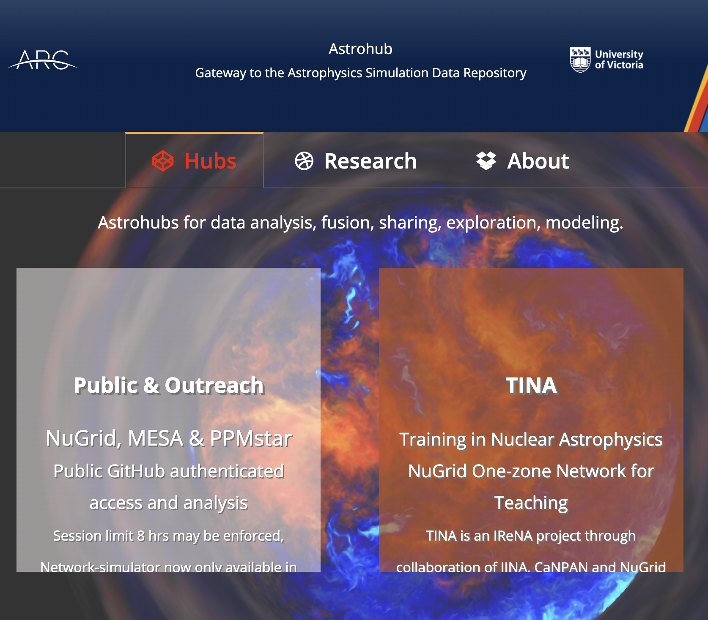
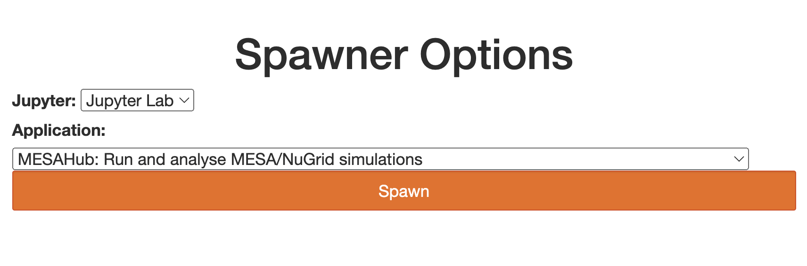
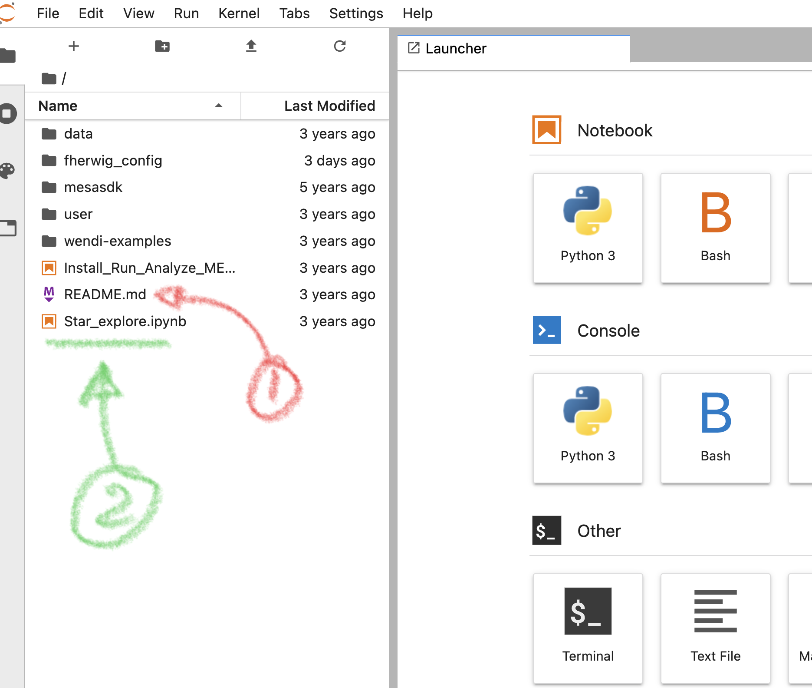

# Stellar evolution models on the Astrohub

The **Astrohub** is our virtual research platform at the URL https://astrohub.uvic.ca

We will use the _Public & Outreach_ Hub to investigate some pre-computed stellar models. In order to authenticate you need to use again your GitHub account name. 

Use the defaults in the Spawner menu:

Start by reading the _README.md_ file. The most important difference to the Abacus server is that the home directory is **not** persistent. However, for a small number of files without any data you can use the `user_config` directory which is persistent.

Next, use the `Star_explore` notebook that provides a template analysis of the *NuGrid stellar evolution and nucleosynthesis data set*.

The NuGrid Data set consists of stellar evolution tracks from $1$ to $25 \mathrm{M_\odot}$ and for five metallicities $Z$. They are described in two publications:

1. Pignatari M., Herwig F., Hirschi R., Bennett M., Rockefeller G., Fryer C., Timmes F. X., Ritter C., Heger A., Jones S., Battino U., Dotter A., Trappitsch R., Diehl S., Frischknecht U., Hungerford A., Magkotsios G., Travaglio C., Young P. 2016. NuGrid Stellar Data Set. I.Stellar Yields from H to Bi for Stars with Metallicities Z = 0.02 and Z = 0.01. The Astrophysical Journal Supplement Series. 225:24.
2. Ritter C., Herwig F., Jones S., Pignatari M., Fryer C., Hirschi R. 2018. NuGrid stellar data set - II. Stellar yields from H to Bi for stellar models with MZAMS = 1-25 M⊙ and Z = 0.0001-0.02. Monthly Notices of the Royal Astronomical Society. 480:538.

You can find these and other papers at the [NASA ADS (Astrophysics Data System)](https://ui.adsabs.harvard.edu). 

A key tool that has been used to calculate the stellar evolution models is the open source stellar evolution code MESA which stands for Modules for Experiments in Stellar Astrophysics. It is described in a number of papers starting with

* Paxton B., Bildsten L., Dotter A., Herwig F., Lesaffre P., Timmes F. 2011. Modules for Experiments in Stellar Astrophysics (MESA). The Astrophysical Journal Supplement Series. 192:3.

In the remainder of the class I will explain how stellar models are calculated and what the stellar evolution data sets are, and I will demonstrate how they can be accessed and analysed on the Astrohub. 