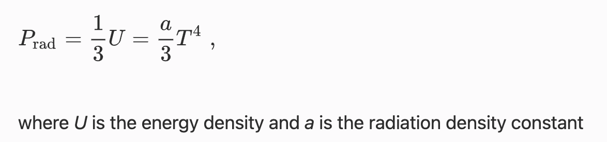
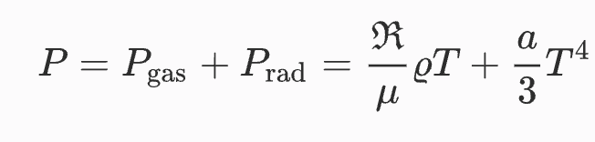
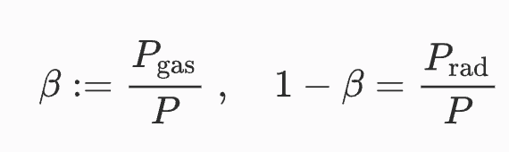

# Equation of State

## Ideal gas

The **ideal gas equation of state** is $P = n k_\mathrm{B} T$​ where $n$ is the number density (number of particles per unit volume) and $\rho = n \mu m_\mathrm{u}$​ astronomers write this as  
$$
P = \frac{\mathcal{R}}{\mu} \rho T
$$
with the gas constant $\mathcal{R} = k_\mathrm{B} N_\mathrm{A}$, $k_\mathrm{B}$ the Boltzmann constant,  $N_\mathrm{A}$ the Avogadro number, $\mu$​ mean molecular weight.

### Gas constant and atomic mass unit

The atomic mass $m_\mathrm{u}$ unit (also known as a Dalton or unified atomic mass unit $u$) is the average mass of a nucleon, or $1/12^\mathrm{th}$ of the mass of one $\mathrm{^{12}C}$. The numeric value of  $m_\mathrm{u}$ and $1/N_\mathrm{A}$ where $N_\mathrm{A}$ is the Avogadro number, are the same. The _molar mass constant_ $M_\mathrm{u}$ is the ratio of the molar mass of an element to its relative atomic mass $A$. 
$$
M_\mathrm{u} = 1\frac{g}{mol} 
$$
A is a dimensionless number. For example, the atomic mass of carbon is 12 while the molar mass (the mass of one mol) is $12 \mathrm{g/mol}$. The atomic mass unit is
$$
u = m_\mathrm{u} = \frac{M_\mathrm{u}}{N_\mathrm{A}} \mathrm{\ .}
$$
Then the gas constant can be written either as _per mol_ as  
$$
\mathcal{R} = k_\mathrm{B} N_\mathrm{A} =\frac{k_\mathrm{B}  M_\mathrm{u}}{m_\mathrm{u}}
$$
or as _per g_ as is typically done in stellar evolution: 
$$
\mathcal{R} = k_\mathrm{B} N_\mathrm{A} / M_\mathrm{u}  =\frac{k_\mathrm{B}}{m_\mathrm{u}} \mathrm{\, . }
$$

### Mean molecular weight

The **mean molecular weight** $\mu$ of a stellar gas is the mean weight of each particles including nucleii and electrons (unless specifically stated otherwise) and is given by the formula:

$$
\mu = \frac{1}{\sum_i \left( \frac{X_i}{A_i}(1+Z_i\right)}
$$

where:
-  $X_i$ is the mass fraction of the $i$-th element in its atomic form,
-  $Z_i$ is the mass fraction of the $i$-th element in its ionized form,
- $A_i$ is the atomic mass number of the $i$-th element (number of protons and neutrons).
-  The sum is taken over all elements.

Let's do an example!!!

### Basic thermodynamics 

The first law of thermodynamics
$$
dq = d\epsilon + PdV
$$

where $V = \frac{1}{\rho}$ is the specific volume, P pressure and $\epsilon$ the inernal energy and $dq$​ the head added or subtracted. 

For an ideal gas and setting $\mu = 1$ the **differential form of the EOS** $P = \mathcal{R} T / V$ or $T = P V /\mathcal{R}$ is 
$$
\frac{dT}{dV} = \frac{1}{\mathcal{R}}\left ( V \frac{dP}{dV} + P \right ) \\
\mathcal{R}dT = VdP +PdV
$$
The **specific heat** is 
$$
c = \frac{dq}{dT} = \frac{d\epsilon +PdV}{dT}\\
c_\mathrm{V} = \frac{d\epsilon}{dT} \mathrm{\ for\ }V=\mathrm{const}
$$
With $dq = c_\mathrm{V}dT + \mathcal{R}dT - VdP$ and $P=\mathrm{const}$ $\rightarrow$ $dq = (c_\mathrm{V} + R)dT = c_\mathrm{P}dT$ with $c_\mathrm{P} = c_\mathrm{V} + \mathcal{R}$​.

If $N$ is the particle density 
$$
N = \frac{\rho}{m_\mathrm{u}} = \frac{\rho N_\mathrm{A}}{M_\mathrm{u}}
$$
then the internal energy per unit volume and the specific internal energy follows. 

**Internal energy per particle:** $\frac{\alpha}{2}k_\mathrm{B} T$ where $\alpha$ is the number of degrees of freedom $\alpha=3$ for monatomic gas

**Internal energy per mol:** $\frac{\alpha}{2}N_\mathrm{A}k_\mathrm{B} T = \frac{\alpha}{2}\mathcal{R} T$ (here we use $\mathcal{R}$ in units _per mol_ )

**Internal energy per unit volume:** $ \frac{N}{N_\mathrm{A}}  \frac{\alpha}{2}\mathcal{R} T = \frac{\rho}{M_\mathrm{u}} \frac{\alpha}{2}\mathcal{R} T$

**Internal energy per unit mass:** $u =  \frac{\alpha}{2}\frac{\mathcal{R}}{M_\mathrm{u}}T$ or $ \frac{\alpha}{2}\mathcal{R}T$ if  use $\mathcal{R}$ in units _per mol_ 

The **specific heat for an ideal gas** is
$$
c_\mathrm{V} = \frac{du}{dT}|_V = \frac{\alpha}{2}\mathcal{R}
$$

where $\alpha = 3$ the number of degrees of freedom for a monatomic gas, and $$c_\mathrm{P} = (1+\frac{\alpha}{2})\mathcal{R}$$ and the adiabatic index is
$$
\gamma := \frac{c_\mathrm{P}}{c_\mathrm{V}} = \frac{2+\alpha}{\alpha}\\
\gamma = \frac{5}{3} \mathrm{\ for\ monatomic\ gas}
$$

### The polytropic relation of an adiabatic stratification for an ideal gas

Now we will consider essential thermodynamics in order to derive the polytropic relation of an adiabatic stratification for an ideal gas. Thus we will answer the question of what the relationship
of density $\rho$ and pressure $P$ is inside a fluid element that is rising (or descending) adiabatically in a hydrostatic stratification.

For an adiabatic process 

$$
dq = 0 = PdV + d\epsilon = PdV +c_\mathrm{V}dT = PdV + c_\mathrm{V}\frac{1}{\mathcal{R}}(PdV+VdP)\\
=(1+\frac{c_\mathrm{V}}{\mathcal{R}})PdV + \frac{c_\mathrm{V}}{R}VdP
$$

and thus
$$
(R + c_\mathrm{V})\frac{dV}{V} + c_\mathrm{V}\frac{dP}{P} = 0
$$
and using the definition of $\gamma$ and  $c_\mathrm{P} = c_\mathrm{V} + \mathcal{R}$ and after integrating the equation we get
$$
V^\gamma P = V_0^\gamma P_0 = K \rightarrow P = K \rho^\gamma
$$
This is the relation of P and $\rho$​ in an ideal gas fluid element that rises or descends adiabatically. Any relation of this functional form is called a _polytropic_ relation.

### Stability of a stratified medium

Blackboard

## Ideal gas with radiation

