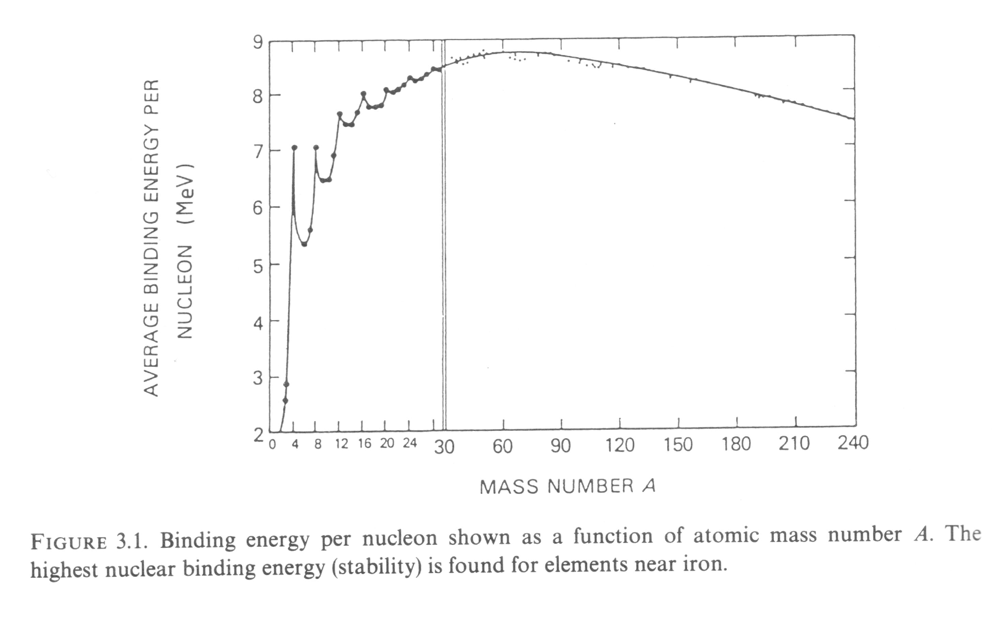

# Nuclear reactions

## Nuclear network equations

## Charged particle reactions and neutron captures

[Rolfs & Rodney: Cauldrons in the Cosmos]

## H burning

[Kippenhahn & Weigert 18.5.1]

#### PP chains

#### CNO chains

### He burning

