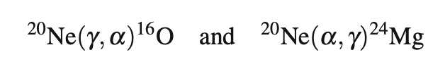
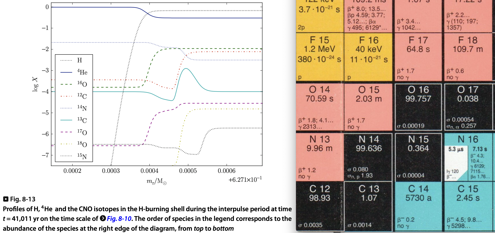

# Nuclear reactions and nucleosynthesis

Each species can in principle do all of 12 reactions: 

Reaction | Explanation | Example
----------|------------|----------
$(p, \gamma)$ | Proton Capture: A nucleus absorbs a proton and emits a gamma ray | $^1_1H + ^7_3Li \rightarrow ^8_4Be + \gamma$
$(p, \alpha)$ | Proton Capture and Alpha Emission: A nucleus absorbs a proton and emits an alpha particle | $^1_1H + ^{14}_7N \rightarrow ^{12}_6C + ^4_2He$
$(\alpha, \gamma)$ | Alpha Capture: A nucleus absorbs an alpha particle and emits a gamma ray | $^4_2He + ^{12}_6C \rightarrow ^{16}_8O + \gamma$
$(\alpha, p)$ | Alpha Capture and Proton Emission: A nucleus absorbs an alpha particle and emits a proton | $^4_2He + ^7_4Be \rightarrow ^{10}_5B + ^1_1H$
$(\alpha, n)$ | Alpha Capture and Neutron Emission: A nucleus absorbs an alpha particle and emits a neutron | $^4_2He + ^9_4Be \rightarrow ^{12}_6C + n$
$(n, \gamma)$ | Neutron Capture: A nucleus absorbs a neutron and emits a gamma ray | $n + ^{56}_{26}Fe \rightarrow ^{57}_{26}Fe + \gamma$
$(n, p)$ | Neutron Capture and Proton Emission: A nucleus absorbs a neutron and emits a proton | $n + ^{14}N \rightarrow ^{14}C + p$ 
$(n, \alpha)$ | Neutron Capture and Alpha Emission: A nucleus absorbs a neutron and emits an alpha particle | $n + ^6_3Li \rightarrow ^3_1H + ^4_2He$
$(\gamma, n)$ | Photodisintegration by Neutron Emission: A nucleus absorbs a gamma ray and emits a neutron | $\gamma + ^9_4Be \rightarrow 2^4_2He + ^7_3Li$
$(\gamma, p)$ | Photodisintegration by Proton Emission: A nucleus absorbs a gamma ray and emits a proton | $\gamma + ^{15}_7N \rightarrow ^{14}_6C + ^1_1H$
$(\gamma, \alpha)$ | Photodisintegration by Alpha Emission: A nucleus absorbs a gamma ray and emits an alpha particle | $\gamma + ^{12}_6C \rightarrow ^8_4Be + ^4_2He$
$(\beta^+)$ | A proton is converted into a neutron, positron, and neutrino| $^{15}_8O \rightarrow ^{15}_7N + e^+ + \nu_e$
$(\beta^-)$ | A neutron is converted into a proton, electron, and antineutrino|  $^{14}_6C \rightarrow ^{14}_7N + e^- + \bar{\nu}_e$
$(e^- \text{capture})$ | A proton captures an electron and converts into a neutron and neutrino| $^7_4Be + e^- \rightarrow ^7_3Li + \nu_e$

## Charged particle reactions and neutron captures

[Rolfs & Rodney: Cauldrons in the Cosmos]

### Nuclear energy generation

Energy generation in stars through nuclear fusion occurs due to the mass defect, the difference between the mass of the reactants and the products. This mass difference is converted into energy according to Einstein's mass-energy equivalence principle, $E=mc^2$​.

## Nuclear network equations

#### Reaction rates

[Maeder Chapter 9.1, 9.2]

### H burning

[Kippenhahn & Weigert 18.5.1]

#### PP chains

#### CNO chains

#### Difference in energy generation
The energy carried away by neutrinos differs between the two processes, with the CNO cycle typically emitting higher-energy neutrinos, resulting in slightly different net energy outputs.

### He burning

With $\nu = 40 \dots 19$ for $T_\mathrm{8} = 1 \dots 2$

### C burning

Secondary reac tions: 

### Ne burning

 and 

With an energy generation T exponent of 49.

### O burning

 In equilibrium with 

## Nuclear burning stages in the Kippenhahn diagram 

Evolution of a massive star with $M = 15\mathrm{M_\odot}$ 

 

<video src="Notebooks_Movies_Papers/20M_Z0.0001.mp4"></video>

Let's explore the interplay between nuclear burning and mixing on the Astrohub.

## Neutron capture nucleosynthesis

### Astrophysical site of the s process in AGB stars

[Herwig 2005, ARAA]

### The r process

See [Movie r-process.m4v of slides](Notebooks_Movies_Papers/r-process.m4v) in the `Notebooks_Movies_Papers` folder of repository.

## H shell burning

