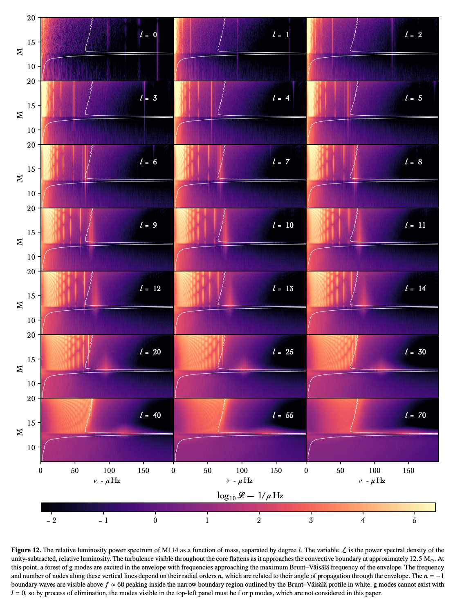

# Time-dependent stellar evolution

## Time scales

### Free-fall time 

The time scale on which a self-gravitating system (e.g., a cloud of interstellar gas or a star) would collapse under its own gravity in the absence of any internal pressure or opposing forces. Star reacts on this time scale if you switch off the pressure support.
$$
t_\mathrm{ff} \approx \sqrt{\frac{1}{3G\rho}}
$$

### Kelvin-Helmholtz or thermal time scale

Time scale on which energy content escapes for a given luminosity. Star reacts on this time scale if you switch off the source of energy (nuclear burning).
$$
t_\mathrm{th} \approx \frac{E_\mathrm{int}}{L}
$$
Where $E$ is the internal energy of the system and $L$ is the luminosity.

### Nuclear time scale

Time scale on which star consumes nuclear fuel, e.g. for the sun the main-sequence life time. 

## Stellar evolution of a low-mass star

How are the evolution in the $\log T_\mathrm{eff}$ - $\log L$ and the   $\log T_\mathrm{eff}$ - $\log R$ diagram related?

## The final collapse of massive stars

[Chapter 5 in Limongi & Chieffi 2008 paper in the Notebooks_Movies_Papers directory]

* When the Fe core has formed at the end of the lives of massive stars it is mainly supported by the partially degenerate electrons ($P_\mathrm{el} \approx 10^{28} \mathrm{dyne/cm^2}$) that dominate over the contribution given by both the radiation ($P_\mathrm{rad} \approx 10^{26} \mathrm{dyne/cm^2}$) and the ions ($P_\mathrm{ion} \approx 10^{25} \mathrm{dyne/cm^2}$). 
* As the gravitational contraction proceeds, the density increases and this favors the electron captures onto the iron-group nuclei. This removes the major source of pressure against gravity, i.e., the elec- trons. 
* As the temperature increases, following roughly the relation $T^3 \approx \rho$, the star enters a region in which the nuclear statistical equilibrium distribution favors a large abundance of free α particles. The binding energy of this new configuration is lower than the previous one, i.e., the one dominated by the iron peak nuclei, hence this process subtracts energy to the structure. 
* These two instabilities favor the gravitational contraction of the iron core. 
* When the electrons become relativistic, the adiabatic index becomes equal to 4/3 and the structure becomes unstable. A strong gravitational collapse begins.
* During the collapse the density increases progressively until, in the inner zones, it reaches the typical values of the nuclear matter, the equation of state suddenly stiffens, the col- lapse of the inner zones abruptly halts and a re-bounce is produced that launches a shock wave propagating outward in mass in the remaining portion of the iron core.

Burrows & Vartanyan 2021, Nature, 589. 

## Asteroseismology

### 3D oscillations in stars

#### The displacement amplitude

#### p Modes and g Modes

There are two main sets of solutions to the equation of motion for a pulsating star, and these lead to two types of pulsation modes: p modes and g modes.

##### 

##### Vorticity images of core-convection simulations 

**M162** $1536^3$ grid, 10x heating boost

**M116** $1152^3$ grid, 100x heating boos

##### $k$ - $\omega$ diagram from 3D simulations in the stable envelope of a massive star ([Thompson+ 23](https://arxiv.org/abs/2303.06125))

#### Asymptotic relations

##### p modes

##### g modes

