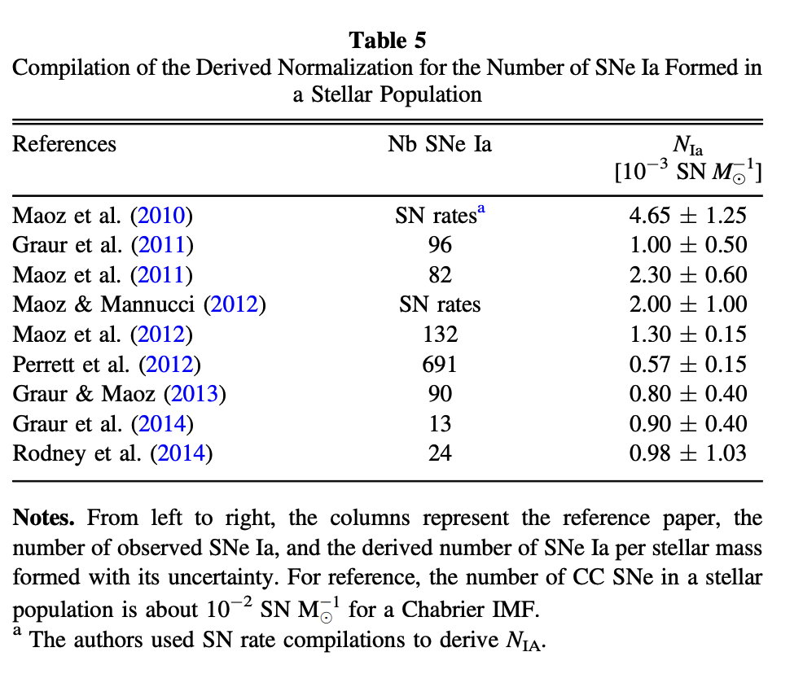
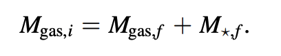
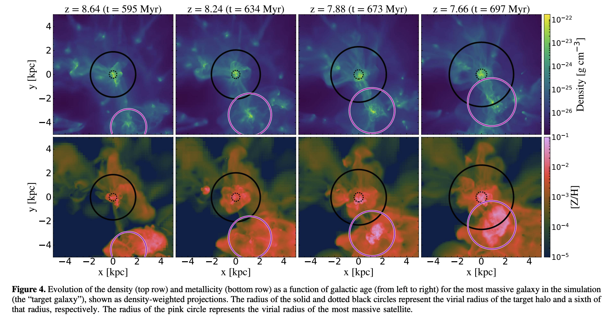

# Galactic chemical evolution

[
https://ui.adsabs.harvard.edu/abs/2016ApJ...824...82C/abstract](https://ui.adsabs.harvard.edu/abs/2016ApJ...824...82C/abstract)

https://ui.adsabs.harvard.edu/abs/2016MNRAS.463.3755C/abstract

https://ui.adsabs.harvard.edu/abs/2017ApJ...835..128C/abstract

## Closed Box model

* Ignore inflow and outflows

#### lower and upper mass limit of IFM

#### Initial mass function

### SNe Ia 

Progenitors delay time distribution and how many SNIa are there?

#### Single degenerate evolution to SNIa

#### Double degenerate evolution to SNIa

The rate of SNIa explosions is

SN II rates can be calculated from the IMF, and while there are observed relations between SN II and SN Ia rates such relations may be misleading. Instead, integrate SNIa explosion rates of significant times:

* Current stellar mass to normalize star formation history (SFH)

* Current mass of gas to calculate initial gas mass

  

  

* Star formation history
  

   Using the

  ### Other parameters

* Upper Mass Limit for CC SNe Progenitors, which ones go into BH?

* Minimum mass for CC SN

* Transition Metallicity, switch from Z=0 to lowest Z available

* Initial mass range for SNIa progenitors

  

## GCE following hierarchical structure formation processes

