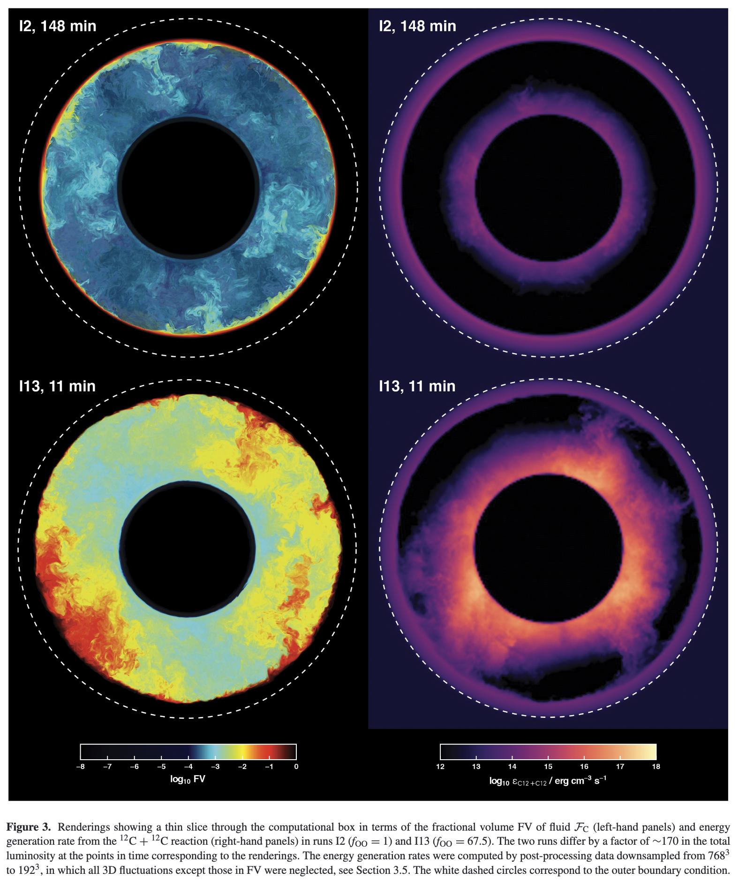

# Project

#### Process for selecting your project topic 
* on the March 5 quiz I will ask you for your initial project idea, you could change it later
* in the March 8 class I will ask you about some brief summary of your project idea to explain to the class and get a question or comment
* on the March 12 quiz I ask you to write down the final project title and a one-sentence summary of the project goals

## Elements of the research proposal

1. Problem, why is it interesting or important, why does matter, impact
2. What has been done before, state of the art
3. What I am going to do, describe the scope (goals and objectives)
4. Feasibility and risks, are the methods proposed suitable for the goals (time line)

Part 3 and 4 would be ideally based on some _rapid proto-typing_ of some ideas. 

## Expectation for presentation

Here are some key points to consider that I will use in finding my grade:

* ##### Content of presentation:
  
   - Motivate the problem, why is it interesting, what is the impact, why should anyone care
   - Describe the state of the art: what have other researchers done about it? This could be at the level of an advanced textbook, book chapter or review article.
   - What are your goals and objective?
   - Methods and assumptions: how will you approach this problem, e.g. literature study, analyse NuGrid or PPMstar models, create your own simulation, e.g. a network code, what observational data would you compare to?
   - Results: what is the main outcome, or what do you expect to be the outcome? Be quantitative if you can.
   - Discussion, conclusion, outlook: summarize and then discuss your most important results critically, in terms of possible shortcomings and in comparison to other work. What can you conclude from your work? Can you provide an outlook as to what useful future directions of this line of research would be. For example, if you had 10 more weeks, how would you prioritize future work?
   
* Clarity of presentation: are the slides appropriate to support the message, and do the spoken words match the visual, staying on time

* Answer questions appropriately

   

## Expectations for final report:

* Use the paper template of one of the standard astronomy journals, e.g. MNRAS, ApJ etc
* The report should have the form and style of a paper
* The length should be about three pages, and not more, including figures. Think carefully which figures best support your results and findings. An appendix can be added with supplemental material and figures, if you feel you have additional results you want to document but maybe don't have space to discuss and include in the main part. Any appendix will only count little toward the grade. 
* The elements of your report should include all of the following:

---

### Title
The title is an abstract of the abstract. Ideally it should not only say what the paper is about but if possible also what the main result is. 

### Abstract
The abstract summarizes not what has been done but what the main results are. Being quantitative is a bonus! The abstract should make the reader want to read the paper or report.

### Introduction
The introduction has the following elements:
* Why is the topic important and interesting? What is the key question that needs answering?
* What has been done by previous researchers to address the question, including the relevant references? and why is that insufficient, why is there a need for more work?
* What will this paper do, and what will it **not** do (defining the scope including the limits of the investigation is key!)
* The last paragraph gives a brief account of what each section will do.

### Methods
Some variations are possible here, e.g. this can include a description of the simulations that have been run. But in general this section describes the methodology and the assumptions that have been made. Which codes and which data has been used? What algorithms and numerical methods have been used. Assumptions of the data used etc.

### Results
This is the key section of the paper. The main results are described. Figures appear in the order in which they are called out. Figure labels and legends have at most one size down in font size compared to the text of the paper. Figure captions describe what can be seen in the figure, not the meaning or implication of what is shown. Figure lines need to be distinguished with shape, color and if appropriate with glyphs. Use colourblind friendly colours. Results are presented in this section but not discussed in any major fashion. 

### Discussion and conclusion
The discussion includes a comparison with results from others, and it assesses in how far the goals of the paper have been accomplished. It may start with a brief summary of key results, can be done in a bullet list. Here, shortcomings of the approach and results are critically discussed.

The conclusions often outline what remains to be done and what the next interesting open questions are to be tackled in this line of research. Provide an outlook.

### Some general comments

Follow these guidelines as much as possible:

* Each statement should be backed up either by a reference or by original research presented in the report!
* People have different strategies about writing such a text; my recommendation is the following:

  1. Write the title and abstract first. In the abstract anticipate what you think your main results will be, understanding that you will rewrite the abstract at the end.
  2. Set up the sections, write a bullet list with 3-5 points what each section or subsection is going to contain.
  3. Put in the Figure Latex environment for each figure, commenting the actual include command, but write out a draft of the figure caption, e.g. plan out the figures. Make the figures and insert them, can be draft figure, but based on real data. If you write your report in Word or Pages just add figure caption placeholders or mock-up figures.
  4. Once you think you are done with figures, and the figures tell the story of the paper, only then start to fill in the text. In a first round just write fast and don't worry about the best words, just put rough text in each section all the way to the end. 
  5. At this point check the balance of the overall paper. This is also your last chance to change figures.
  6. When you are happy and have committed to the figures, then spend the rest of your time improving the text and making the figures nice. For the text do two iterations. In the first you make sure that the text actually say exactly what you want to say, checking for clear and unambiguous language. In the second and maybe even last iteration you are reading again and you ask each phrase, word and sentence if it **has** to be there by checking if it can be deleted - you will be surprised by how much you can shorten the text. The shorter you text the better because you are increasing the textual signal to noise by weeding out text that is not absolutely needed.

---

## General tools available for your research

* Analysis of NuGrid MESA and post-processing data
* MESA stellar evolution runs (need to keep it simple!)
* Analysis of hydro data on the ppmstar.org virtual research platform, e.g. the CoCo Hub
* Literature project investigating a special topic

## Project ideas

* Something on Pop III stars
* Using MESA for Pop III stars
* Origin of Mg or K
* Asteroseismology of extreme stars, e.g. rapidly rotating stars
* Effects of DM on stellar processes
* Stellar lifetimes from red dwarfs to giants
* Ca production in Pop III stars
* Conditions at the high-mass termination of the n-capture nucleosynthesis
* How would $4^{th}$ generation (metal-rich?) stars look like?

### Pop III stars

#### Ca production

CNO breakout at $^{19}$F

https://cococubed.com/code_pages/burn_hydrogen.shtml

https://ui.adsabs.harvard.edu/abs/2018MNRAS.474L..37C/abstract

https://ui.adsabs.harvard.edu/abs/2021PhRvC.103e5815D/abstract

https://ui.adsabs.harvard.edu/abs/2022Natur.610..656Z/abstract

#### Pop III C isotopic ratios

### Effects of DM on stellar processes

https://ui.adsabs.harvard.edu/abs/2023ApJ...959..113B/abstract

### Conditions at the high-mass termination of the n-capture nucleosynthesis

https://ui.adsabs.harvard.edu/abs/2024PhRvL.132e2701V/abstract

### Origin of Mg or K

**Mg** is a so-called **$\alpha$ element** and is used as one of several proxies for nucleosynthesis in massive stars; one can find literature of stellar observations, typically in a galactic chemical evolution (GCE) context, where O, Mg, Si, Ca and sometimes even Ti are used interchangeable. It would be interesting to investigate how these so-called $\alpha$​​​ elements really correlate in the NuGrid models in massive stars.

This [APOGEE paper](https://doi.org/10.3847/1538-4357/aa7ddc) gives and example for a GCE analysis of the Sagittarius Dwarf Galaxy:

* The origin of K and nearby odd-Z elements is still not entirely clear. Galactic chemical evolution simulations are notoriously short of K, P, Cl and Sc. One proposal to solve this was the convective-reactive nucleosynthesis as part of a O-C convection shell merger https://ui.adsabs.harvard.edu/abs/2018MNRAS.474L...1R/abstract

This nucleosynthesis site is based on 3D hydrodynamic simulations by [Andrassy+ 20](https://ui.adsabs.harvard.edu/abs/2020MNRAS.491..972A/abstract) 

It would be possible to run an existing nucleosynthesis multi-zone simulation, which produces output equivalent to the NuGrid post-processing output. A student could run the simulation on the astrohub, each run would take maybe an hour or so. The student could pick some reactions and change their value and explore the impact this would have on the predicted abundances.

### Asteroseismology of rotating stars

Have a look at the review article [Angular Momentum Transport in Stellar Interiors Show affiliations](https://ui.adsabs.harvard.edu/abs/2019ARA%26A..57...35A/abstract)

An example for the rotational splitting 

