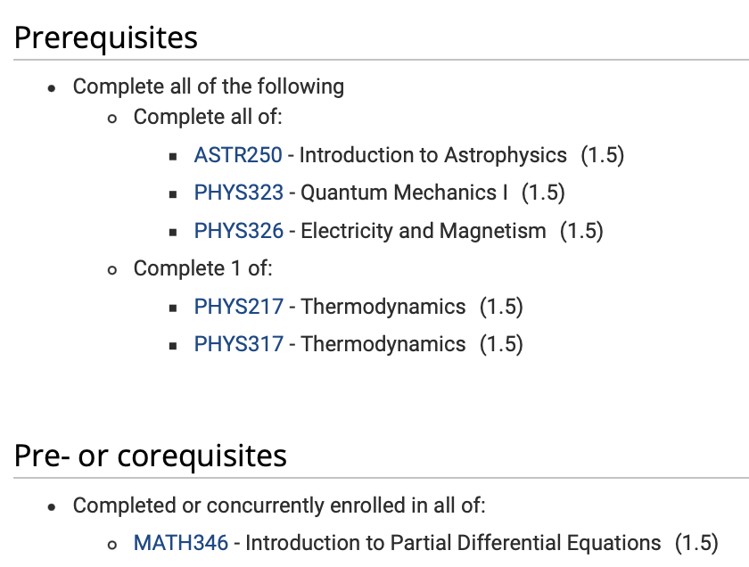

# AST 404 Introduction to Stellar Astrophysics

Spring Term 2024

**Instructor:** Falk Herwig (fherwig@uvic.ca)

**Office hour:** Thu noon - 1:00pm

**Prerequisites:**

**Course materials:** Brightspace and git repository on https://github.com/fherwig/ASTR404_24 (send me your github user name and I will add you to the repository).

**Class times:** Tue, Fri 3:00-4:20pm Ell 161

## Course content

The structure and evolution of stars is the result of intricate interaction of different types of physics processes, such as 

* Conservation laws of fluid dynamics and stellar structure 
* Atomic physics of radiation-matter interaction
* Energy transport by radiation and convection
* Thermodynamics and the equation of state of a wide variety of conditions from the dilute atmospheres of stars to the extreme high-energy-density conditions in the cores of late phases of stars, such as white dwarfs and neutron stars
* Nuclear physics of element formation and energy generation that fuels the life of stars

These physics principles to phenomena and stellar evolution phases

* The evolution from the main sequence through subsequent stages, ending in white dwarfs, neutron stars or black holes
* Nuclear energy generation and the formation of the elements through nucleosynthesis
* Stellar atmospheres
* Supernova 
* Binary stars
* Asteroseismology and stellar pulsation

In addition to the physics of stars and the specific stellar phenomena and evolution phases the course will familiarize students with several of the research tools astronomers often use. Students are required to carry out mini-projects and computationally-based assignments requiring basic programming skills in Python. We will be using tools like Git, MarkDown, Jupyter. A key element of the course is a student project in the second half of the course.

## Course structure

For each class there will be some assigned reading. At the beginning of each Tuesday class there will be a short quiz, 20min long, in which one or two questions will have to be answered in written form on paper. These questions relate to the assigned reading. The Friday class will start with a 15-20min discussion in which students can volunteer to answer questions regarding the reading assignment for this class.  

* Tuesday: 20min quiz, 10min discussion, 50min lecture
* Friday: 15-20min discussion; 60min lecture

Four homework problems will be concentrated in the first 2/3 of the term while the last 1/3 is reserved for the student mini-project. 

## Assessment

Specifics of the format and expectations regarding the graded items related to the project will be given in class.

| Grade item                          | Due                 | Percent |
| ----------------------------------- | ------------------- | ------- |
| Quizzes                             | Each week Tue 20min | 20   |
| Class participation and discussions | Each Fri            | 5    |
|  Four team-of-two home work problems| 02/15, 03/01, 03/11, 03/18  | 20 |
| Final exam                          | TBD                 | 30     |
| Project presentation                | April 5 (10+3min each, this class will be 30min longer and April 2 will be 30min shorter, if there are no conflicts) | 5   |
| Student project                     | April 17            | 20     |

* In order to pass the course you must get a pass grade in quizzes. There will be 11 quizzes starting on Jan 16. The quizzes will be the average of the best 8. Missed quizzes will get a 0% grade. 
* The teams for the team-of-two home work problems will be randomly determined for each of the four HW assignments. Students who have individual needs that should be considered regarding the team assignment should make this known to the instructor before Jan 16.
* The class participation grade is based on discussion participation in the Friday Q&A session relating to the assigned reading. The instructor will ask 1-3 (average 2) questions and students have the opportunity to volunteer to explain the answer to these questions to the entire class. It is expected that each student volunteers 2-3 times over the period of the course.
* Details and expectations regarding the student projects will be provided later in the term.

 

## Policies

* Important dates: https://www.uvic.ca/calendar/dates
* Graduate calendar: https://www.uvic.ca/calendar/grad/index.php#/home
* Uvic's policy of academic integrity applies: 
  * https://www.uvic.ca/students/academics/academic-integrity/
  * https://www.uvic.ca/calendar/undergrad/index.php#/policy/Sk_0xsM_V?bc=true&bcCurrent=08%20%E2%80%90%20%20Policy%20on%20Academic%20Integrity&bcGroup=Undergraduate%20Academic%20Regulations&bcIte%20mType=policies
* The Libraries' guide on plagiarism: https://www.uvic.ca/library/research/citation/plagiarism
* All lecture notes and course materials that are made available to you, and all exams and assignments are the instructor's intellectual property, and are made available to students for instructional purposes only.  The material is protected under copyright law, even if not marked with a ©. You may not distribute your lecture notes or any exams or assignments from the course without  permission, and to do so, through note‐sharing sites or other means, violates the Policy on Academic Integrity.  

  

